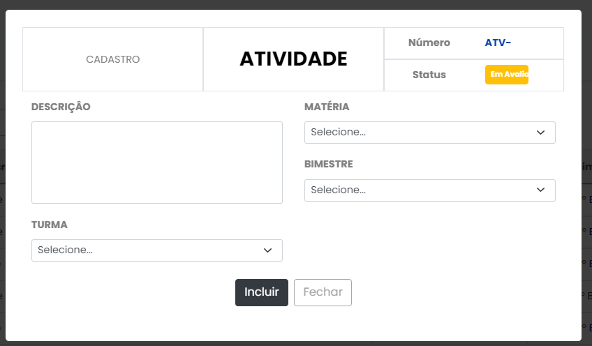
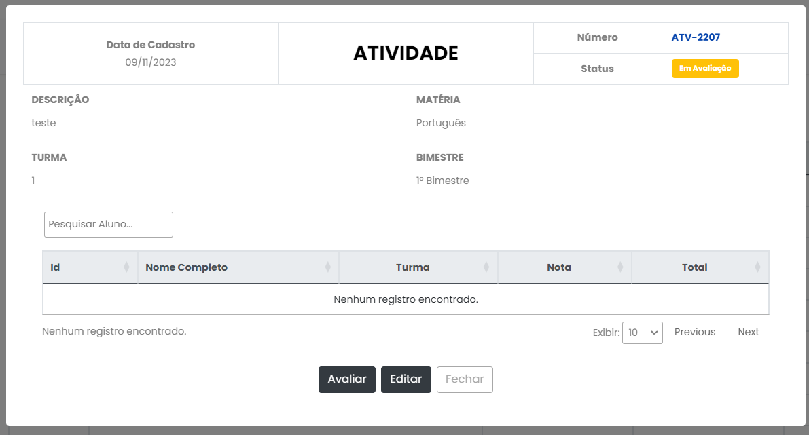
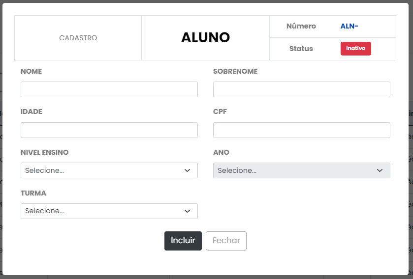
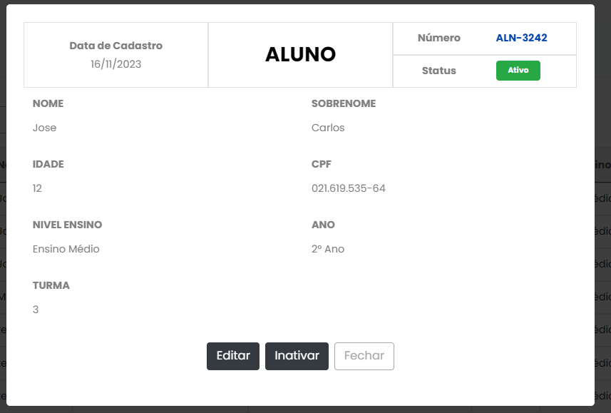
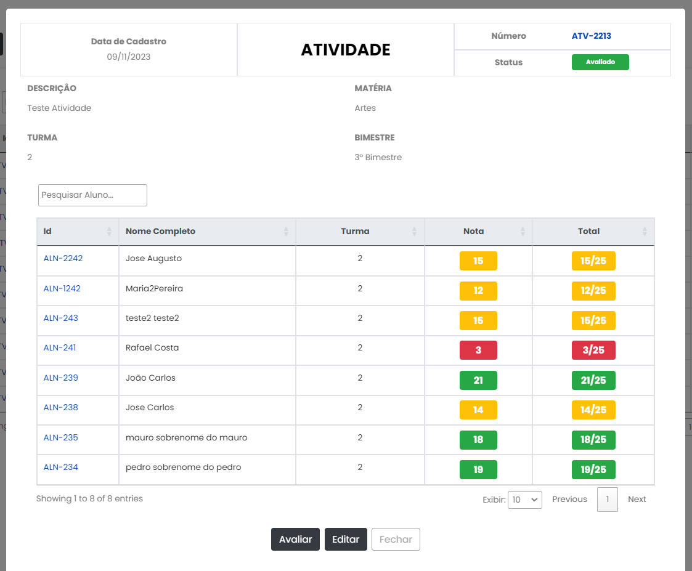
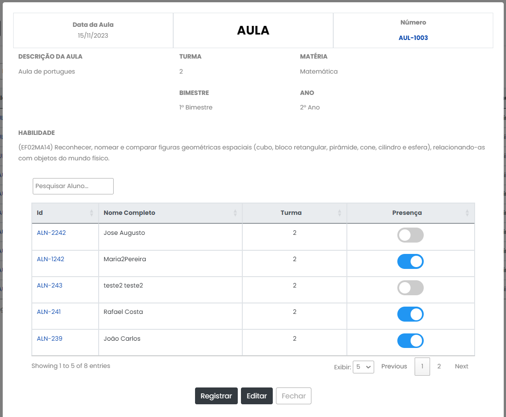

# Programação de Funcionalidades

|Funcionalidade    | RF-004           | 
|------------------|-------------------------------|
|Permitir aos professores cadastrarem atividades levando em consideração o assunto, matéria, bimestre e turma| 
||

---
|Funcionalidade    | RF-005        | 
|------------------|-------------------------------|
|Permitir consulta de atividades relacionadas a matéria lecionada.| 
||
|| 

---
|Funcionalidade    | RF-006        | 
|------------------|-------------------------------|
|Cadastrar informações dos alunos como nome, idade, nivel de ensino, turma, ano e outras informações relevantes.| 
||
|| 

---
|Funcionalidade    | RF-007        | 
|------------------|-------------------------------|
|Permitir consultar alunos seguindo os critérios de nome, turma e ano.| 
||
|| 

---
|Funcionalidade    | RF-008        | 
|------------------|-------------------------------|
|Permitir lançamento de notas do aluno na respectiva matéria cursada.| 
||
|| 

---
|Funcionalidade    | RF-009        | 
|------------------|-------------------------------|
|Permitir que os professores registrem presença ou falta de alunos em cada aula.| 
||
|| 

---
|Funcionalidade    | RF-001        | 
|------------------|-------------------------------|
|A aplicação deverá conter uma tela de cadastro para acesso a aplicação.| 
|.jpeg)|
|.jpeg)|
|.jpeg)|
|| 

---
|Funcionalidade    | RF-002        | 
|------------------|-------------------------------|
|A aplicação deverá conter uma tela de login para acesso a aplicação.| 
|.jpeg)|
|.jpeg)|
|.jpeg)|
|.jpeg)|
|| 

---
|Funcionalidade    | RF-007        | 
|------------------|-------------------------------|
|Permitir consultar alunos seguindo os critérios de nome, turma e ano.| 
|.jpeg)|
|| 
