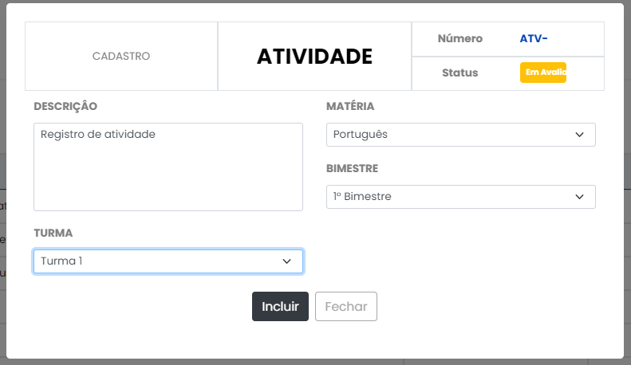
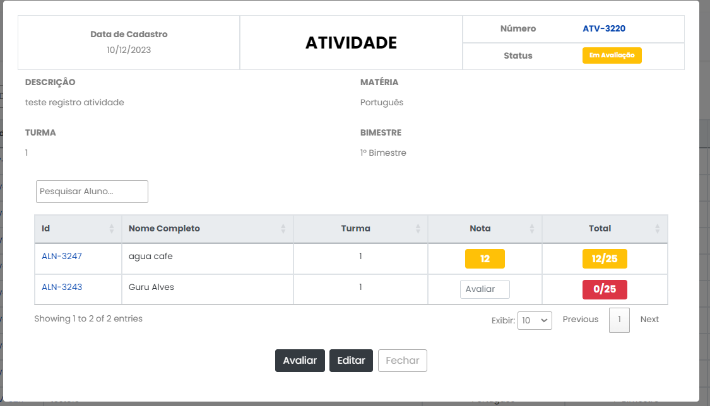
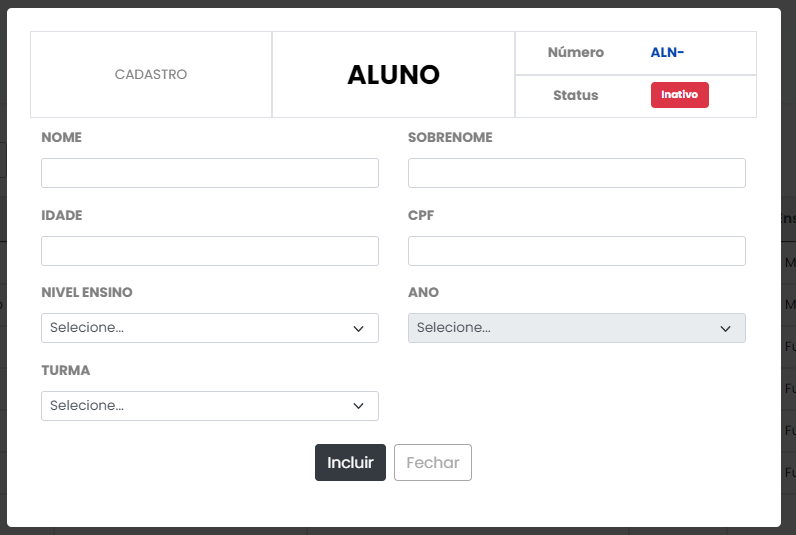
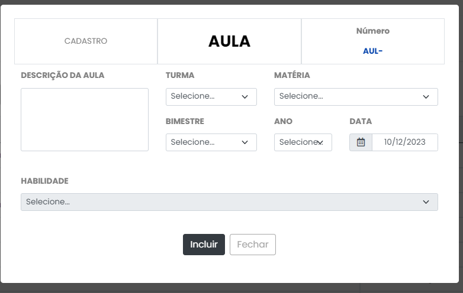
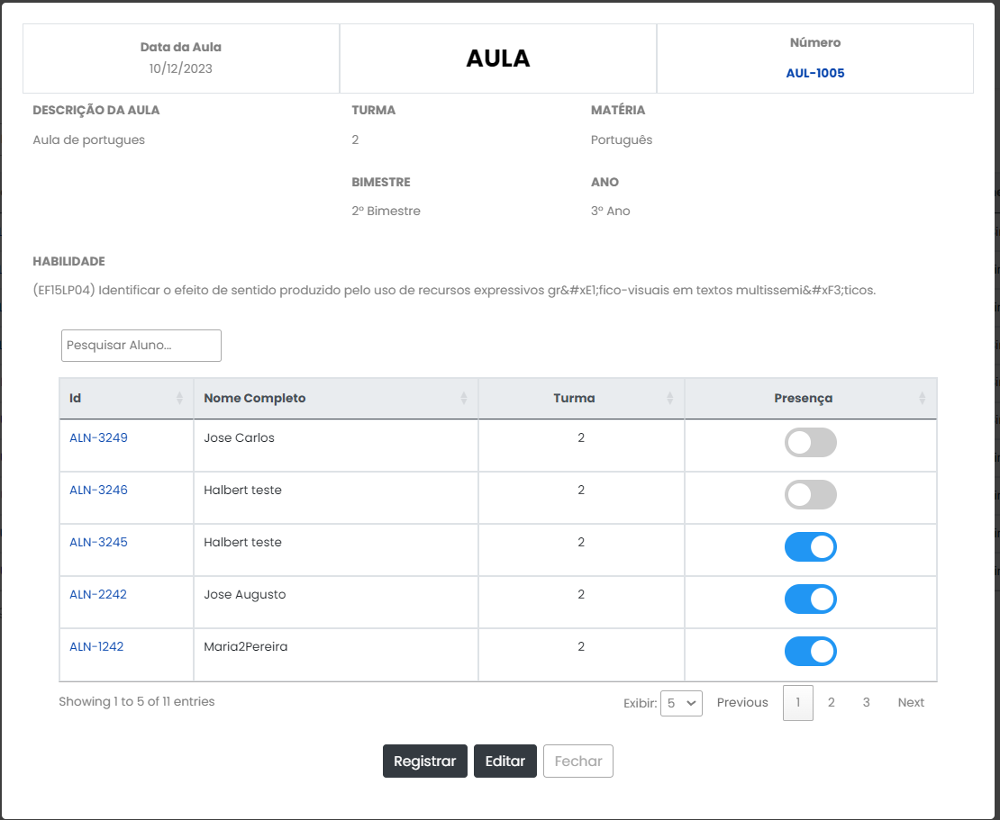

# Registro de Testes de Usabilidade

#### Cenários de Teste:

1 - Registrar Atividade. 
2 - Registrar notas de um aluno. 
3 - Registrar Aluno. 
4 - Registrar Aula. 
5 - Registrar presença de um aluno. 
6 - Navegar pelas diferentes telas do aplicativo.

### Execução dos Testes

#### Cenário 1: Registrar Atividade

---

#### Cenário 2: Registrar Notas

---

#### Cenário 3: Registrar Aluno

---

#### Cenário 4: Registrar Aula

---

#### Cenário 5: Registrar presença

---

### Análise dos Resultados
#### Observações Gerais:
Os participantes conseguiram concluir com sucesso todos os cenários de teste, indicando uma compreensão geral das funcionalidades do aplicativo.

A inclusão de imagens nos registros fornece uma visão visual clara das interações do usuário, facilitando a identificação de padrões de comportamento.

#### Pontos Positivos:

<b>Clareza na Interface:</b> As imagens sugerem uma interface clara e intuitiva, permitindo que os usuários realizem as ações desejadas de forma eficiente.

<b>Variedade de Funcionalidades Testadas:</b> A diversidade nos cenários de teste, como registrar notas, atividades, alunos, aulas e presença, reflete uma abordagem abrangente na avaliação da usabilidade.

#### Problemas Identificados:
<b>Badge de Status cortada:</b> Observou-se uma erro na interface na badge do status no registro de atividade, onde o mesmo aparece cortado.

#### Ações de Melhoria Recomendadas:
Ajustar a badge do status da atividade na hora do registro.

#### Conclusão:
Os resultados indicam uma boa usabilidade geral do aplicativo, mas as recomendações de melhoria podem contribuir para aprimorar ainda mais a experiência do usuário. O ciclo contínuo de testes e melhorias é essencial para manter a qualidade da aplicação ao longo do tempo.